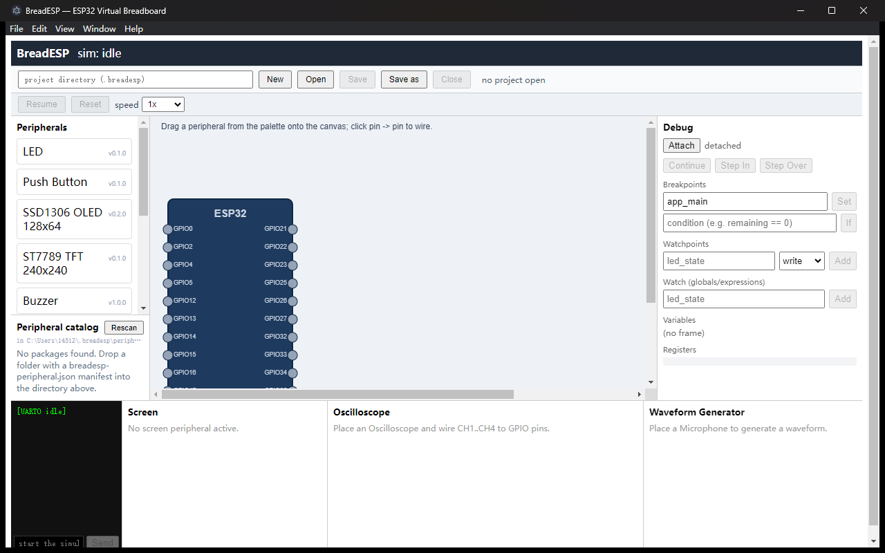
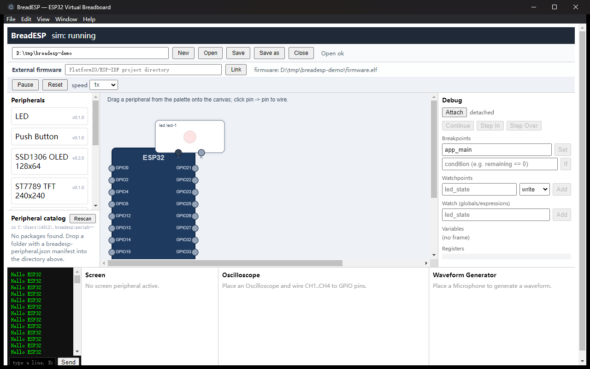

# BreadESP — ESP32 虚拟面包板仿真器

> 本地运行的 ESP32 功能级仿真器：图形化外设搭建、真实固件运行、GDB 调试、串口控制台，全流程离线完成。
> 本仓库**全部由 AI 生成**（PRD 驱动开发）。MIT License。



主界面一览：左列为器件面板（内建 Palette + 本地外设目录），中央是面包板画布（拖放器件、
pin→pin 连线，MCU 节点暴露所选芯片的全部可用 GPIO），右侧为调试面板，底部为串口控制台、
屏幕视图、示波器与波形发生器。



blink 示例工程：LED 连接到 GPIO2，仿真运行中，串口控制台实时输出固件打印的 `Hello ESP32`。

## 功能一览

- **虚拟面包板**：拖放放置外设、pin→pin 连线、删除与清理，撤销/重做（20 步），
  网表（逻辑）与布局（视觉）分离持久化，工程保存/打开/另存为。
- **真实仿真**：QEMU-ESP32 执行真实 Xtensa 固件，支持 ESP32 / ESP32-S3 / ESP32-C3 / ESP32-C6；
  逻辑时钟可 0.1x–10x 调速。
- **调试**：GDB 断点（函数/地址/条件断点/硬件观察点）、单步、变量与寄存器查看；
  另有 DAP 适配器可接入 VS Code。
- **串口**：UART0 输出实时显示（ANSI 兼容），支持向固件注入输入。
- **内建外设**：LED、按键、SSD1306 OLED、ST7789 TFT、蜂鸣器、喇叭（I2S）、
  麦克风（I2S/波形注入）、旋钮、SHT30 温湿度、示波器。
- **外设 SDK**：第三方以独立包形式注册新外设，本地目录扫描加载，
  `pnpm create-peripheral` 脚手架一步生成可发布的外设包。
- **工程关联**：PlatformIO / ESP-IDF 工程目录可整体关联，自动发现 `build/*.elf` 并导入。
- **离线文档站**：`pnpm docs:build` 构建静态文档站（零外部资源，断网可用），
  含 6 篇分步教程。

## 快速开始

环境要求：**Node.js ≥ 20**、**pnpm ≥ 9**；Windows / macOS / Linux。

```bash
pnpm install       # 安装 workspace 依赖
pnpm fetch-qemu    # 按需下载 QEMU-ESP32 二进制（SHA-256 校验，不入库）
pnpm dev           # 启动应用（vite dev server + Electron）
```

启动后跟着教程走第一个工程（从新建工程到 LED 随固件亮灭）：

- [01 · 快速上手](docs/tutorials/01-getting-started.md) — 安装、启动与界面导览
- [02 · 首个工程：点亮的 LED](docs/tutorials/02-first-project.md) — 新建工程、连线、导入固件、运行仿真

没有现成固件时，仓库自带确定性生成的金样固件（`packages/sim-core/fixtures/`，
如打印 `Hello ESP32` 并翻转 GPIO2 的 `blink.elf`），无需 ESP-IDF 工具链即可体验全流程。

### 平台说明

仿真核心分两档，按需准备：

| 能力 | 需要什么 | 获取方式 |
|---|---|---|
| 固件运行、串口、GDB 调试、工程管理 | 常规 QEMU-ESP32 | `pnpm fetch-qemu`（全平台） |
| LED 亮灭 / OLED 渲染 / 按键注入等外设总线联动 | breadesp-dbus 设备版 QEMU | `node scripts/build-qemu-device.mjs`（Docker Linux / MSYS2 构建；Windows 经 WSL 运行） |
| 断点调试 | `xtensa-esp32-elf-gdb`（esp-gdb 17.x） | ESP-IDF 工具链，设 `BREADESP_GDB_BIN` |

## 开发指南

常用命令：

| 命令 | 作用 |
|---|---|
| `pnpm dev` | 开发模式：vite dev server + Electron 主进程（`scripts/dev.mjs` 编排） |
| `pnpm build` | 全仓构建（lib 包 tsc → dist，shell tsc，ui tsc + vite） |
| `pnpm test` | 全仓 vitest（需要真实 QEMU/GDB 的 e2e 自动按环境变量门控，缺二进制时跳过） |
| `pnpm typecheck` | 全仓 TypeScript strict 检查 |
| `pnpm docs:build` / `docs:serve` / `docs:check` | 离线文档站构建 / 预览 / 链接完整性校验 |
| `pnpm --filter @breadesp/<pkg> test` | 单包测试 |

测试门控环境变量：`BREADESP_QEMU_BIN`（常规 QEMU）、`BREADESP_QEMU_DBUS_BIN`（设备版）、
`BREADESP_GDB_BIN`（GDB）。缺省时相关 e2e 自动跳过，不算失败。

包结构（pnpm monorepo，六包分层）：

| 包 | 职责 |
|---|---|
| `packages/ui` | React 渲染进程（面包板、调试面板、串口、屏幕、示波器） |
| `packages/shell` | Electron 主进程 / Bridge（QEMU、GDB、外设管理、IPC） |
| `packages/peripherals` | 外设设备模型（运行于 Bridge） |
| `packages/netlist` | 网表 schema、校验与工程模板 |
| `packages/sim-core` | QEMU 参数构造、ELF 解析校验、dbus 设备 C 源码、金样固件 |
| `packages/docs-site` | 离线文档站构建器 |

数据流：UI 编辑网表 → IPC 下发 → Bridge 重建外设实例与路由 → QEMU 执行固件 →
总线事务经 dbus 设备转发回 Bridge → 外设模型更新 → 渲染快照推回 UI。详见
[docs/architecture.md](docs/architecture.md)。

## 文档

- [PRD.md](PRD.md) — 唯一真相源（需求、接口契约、目录约定）
- [docs/dev-plan.md](docs/dev-plan.md) — 开发计划、里程碑、代码风格、提交规范
- `docs/test-plan.md` — 测试方案与现状清单（不进文档站页面集）
- [docs/architecture.md](docs/architecture.md) — 架构详解
- [docs/peripheral-sdk.md](docs/peripheral-sdk.md) — 外设 SDK 开发指南
- [docs/dap.md](docs/dap.md) — DAP 适配器（VS Code 调试）
- [docs/tutorials/](docs/tutorials/) — 分步教程（上手、首个工程、调试、外设参考、外设创作、VS Code）
- [CHANGELOG.md](CHANGELOG.md) — 变更记录

## AI Agent 约定（PRD §10）

- 代码改动前先读对应 PRD 章节，文件头注释 `// PRD: §X.Y`。
- 不得引入未列在 PRD §5 的运行时依赖；接口（PRD §6）改动须向后兼容。
- 文件 MUST 落在 PRD §7 路径下；不得放置二进制（QEMU 由 `scripts/fetch-qemu.mjs` 拉取）。

## License

MIT — 见 [LICENSE](LICENSE)。
